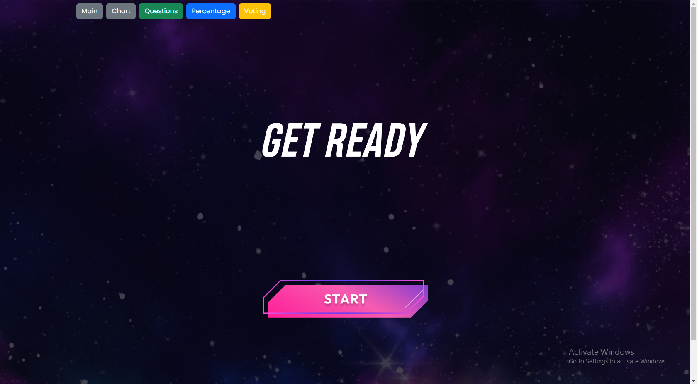
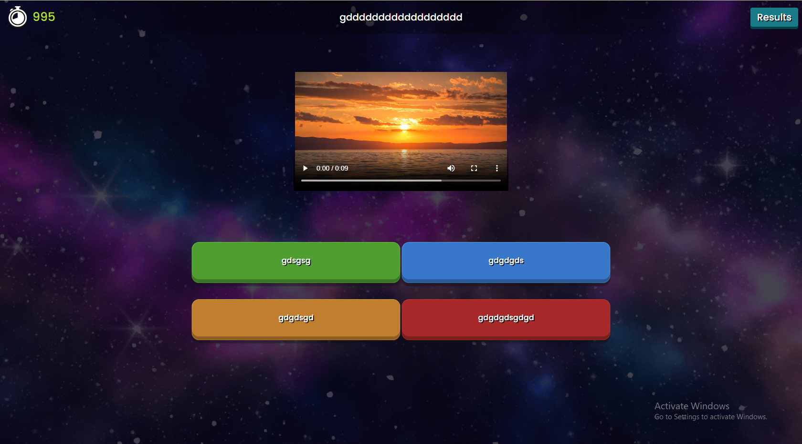
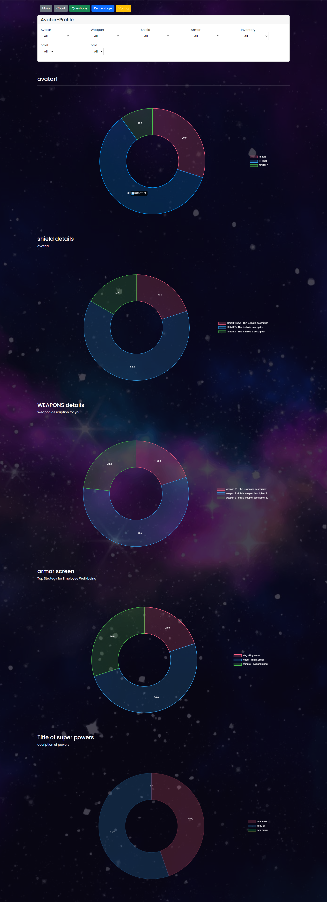
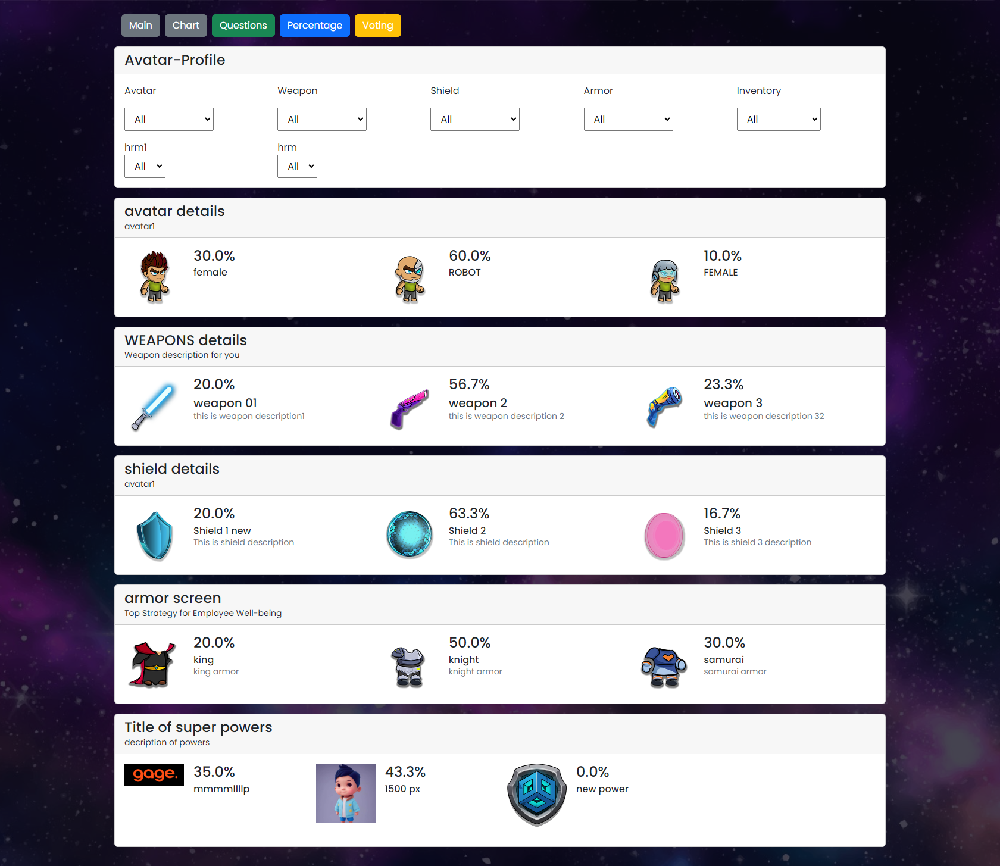
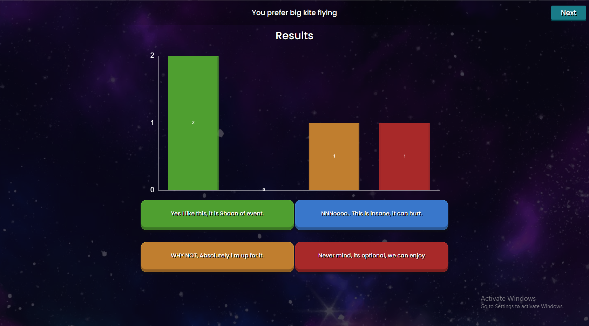
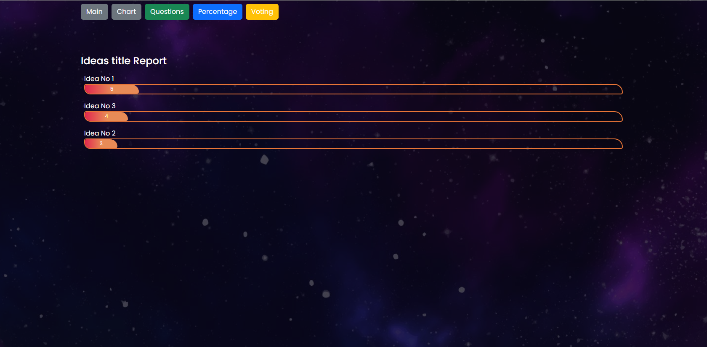

## Admin Dashboard React.js | GAGE Question Panel

### Introduction

<h3 align="center">Gage Question Panel!</h3>
After setting up the event with pushed questions, next step is to start event and push question for users.
Question panel is used to start event and push questions, check reports and stats of event. 
<br>The product is owned by Activ8 Games & developed by Geniteam as sole development partner. This product was used in
Local & international conferences online at various levels.

### Features list

<ol>
<li>Start event</li>
<li>Graphical representation of users selections</li>
<li>Stats of users selections</li>
<li>Reports of questions</li>
<li>Reports of voting</li>
</ol>

### Main Technologies/Libraries Used

<ul>
<li>React.js</li>
<li>Firebase</li>
<li>Bootstrap</li>
<li>reactstrap</li>
<li>react-chartjs-2</li>
<li>styled-components</li>
<li>sweetalert2</li>
</ul>

## Available Scripts

In the project directory, you can run:

### `npm start`

Runs the app in the development mode.<br />
Open [http://localhost:3000](http://localhost:3000) to view it in the browser.

The page will reload if you make edits.<br />
You will also see any lint errors in the console.

### `npm test`

Launches the test runner in the interactive watch mode.<br />
See the section about [running tests](https://facebook.github.io/create-react-app/docs/running-tests) for more information.

### `npm run build`

Builds the app for production to the `build` folder.<br />
It correctly bundles React in production mode and optimizes the build for the best performance.

The build is minified and the filenames include the hashes.<br />
Your app is ready to be deployed!

See the section about [deployment](https://facebook.github.io/create-react-app/docs/deployment) for more information.
### 🗄️ Project Structure
Most of the code lives in the `src` folder and looks like this:
````
.
├── public 
├── src/ 
│   ├── assets 
│   ├── Quiz/ 
│   │   ├── AnswerAll.js 
│   │   ├── Navbar.jsx 
│   │   ├── QuizForm.css 
│   │   ├── QuizForm.js 
│   │   ├── ReportCharts.jsx 
│   │   ├── Reports.js 
│   │   ├── ReportsCard.js 
│   │   ├── Start.css 
│   │   ├── Start.js 
│   │   ├── votingReport.jsx 
│   │   └── Waiting.js 
│   ├── App.css 
│   ├── App.js 
│   ├── index.css 
│   └── index.js 
├── .gitignore 
└── package.json 
````
### ScreenShots

#### Start


#### Push Question


#### Chart Reports


#### Avatar Reports


#### Question Results


#### Voting Reports
