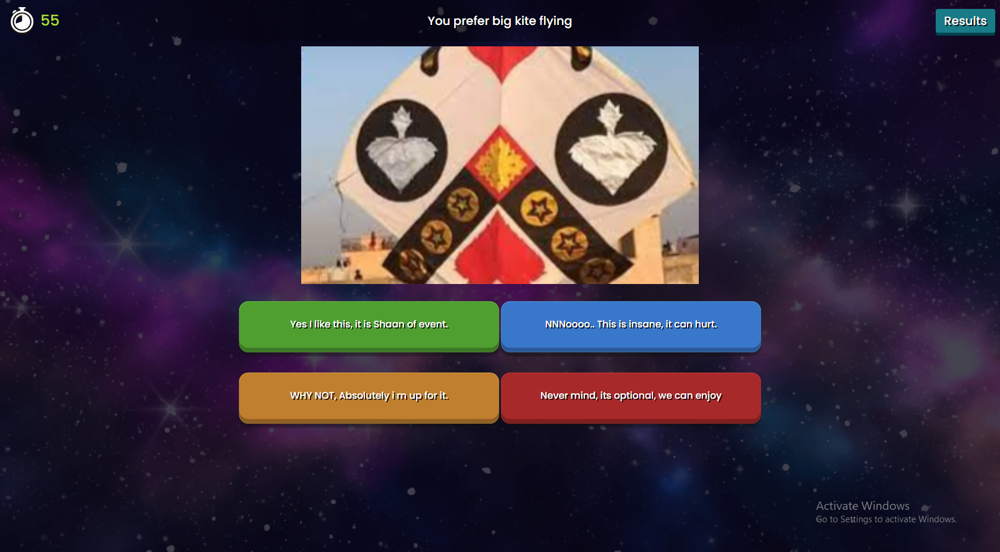
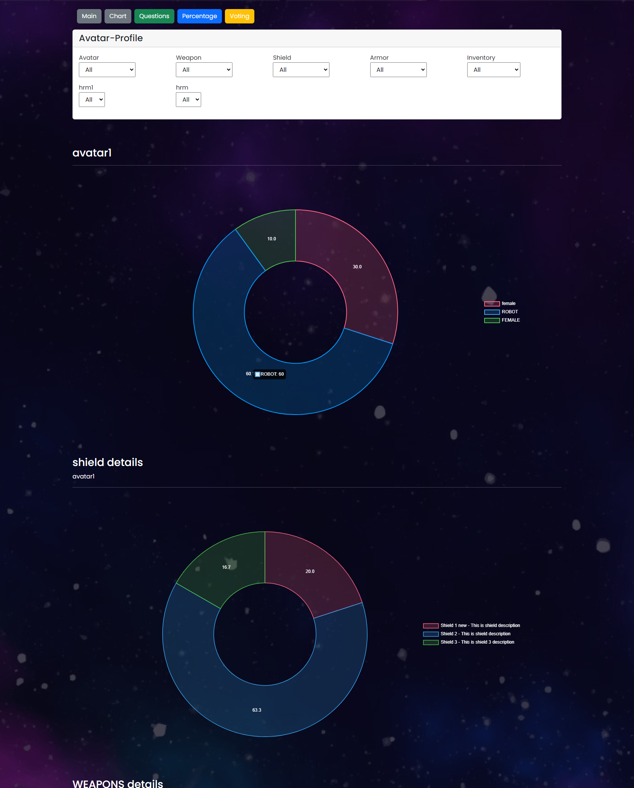

# ReactJs-EventManagment

This is an event management app created using React.js. It allows users to create, edit, and delete events. This app has
two sides - an admin panel and a question panel.
  The product is owned by Activ8 Games & developed by Geniteam as sole development partner. This product was used in
Local & international conferences online at various levels.

### Admin Panel

The admin panel is where event organizers can create and set up events. Here, the event organizer can create a new
event, add questions for the attendees to answer, set the time limit for each question. The
admin panel allows users to manage their events in a user-friendly interface.

### Question Panel

The question panel is used by the admin to start the event and view reports. The admin can customize the appearance of
the question panel and start the event when ready. Attendees can view the questions and submit their answers, and the
app collects the responses for later analysis. The question panel also includes a dashboard where the admin can view
real-time statistics and reports about the event.

## Getting Started

To run this app locally, follow these steps:
<ol>
<li>Clone the repository to your local machine.</li>
<li>Navigate to the project directory (Admin or Question panel) in your terminal.</li>
<li>Run npm install to install the required dependencies.</li>
<li>Run npm start to start the app.</li>
<li>Open your browser and navigate to http://localhost:3000 to view the app.</li>
</ol>

## Features

This app includes the following features:
<ul>
<li>Create events</li>
<li>Edit events</li>
<li>Delete events</li>
<li>View events</li>
</ul>

## Technologies Used

This app was created using the following technologies:
<ul>
<li>React.js</li>
<li>Firebase</li>
</ul>

### Screenshots

